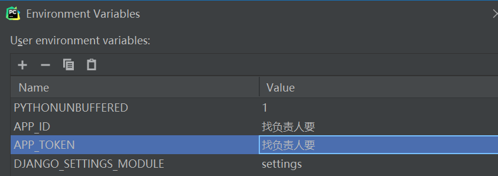
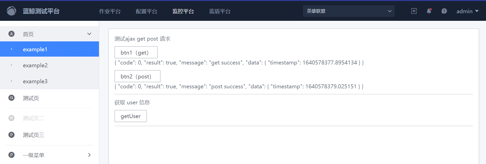
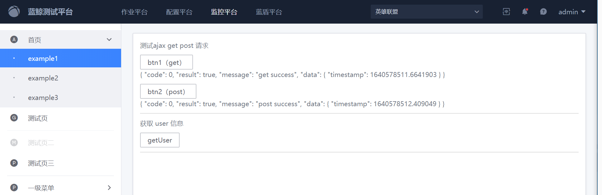

# 蓝鲸高校项目：物资申请系统

- [一、快速开始](#一快速开始)
  - [1. 从主仓库fork代码到自己的个人仓库](#1-从主仓库fock代码到自己的个人仓库)
  - [2. git clone 自己仓库的代码到本地](#2-gitclone自己仓库的代码到本地)
  - [3. 本地运行项目](#3-本地项目运行)
- [二、开发须知](#二开发须知)
  - [1. 开发模式----基于PR的开发模式](#1-开发模式----基于pr的开发模式)
  - [2. 开发流程](#2-开发流程)
  - [3. 开发规范](#3-开发规范)
  - [4. 装饰器的使用](#4-装饰器的使用)
- [三、学习资料](#三学习资料)

## 一、快速开始

### 1. 从主仓库`fock`代码到自己的个人仓库


项目主仓库将开源项目代码 fork 到个人仓库，完成后就可以在个人项目下查看该开源项目代码了

### 2. `git clone`自己仓库的代码到本地

1. 在自己的电脑新建一个空目录（ps：本地开发路径不要包含中文）
2. `cd`进入新建的空目录，进行`git clone`

```powershell
# 克隆自己fork的git仓库代码到本地
git clone https://github.com/{MYUSERNAME}/bk-goods-application.git
# 添加自己fork的主仓库源
git remote add bk-goods https://github.com/TencentBlueKing/bk-goods-application.git
git pull bk-goods
```

### 3. 本地项目运行

1. 在`C:\Windows\System32\drivers\etc`下的`host`文件中添加

	```
	127.0.0.1 dev.paas-edu.bktencent.com
	```

2. 本地创建数据库

	```
	CREATE DATABASE `bk-goods` DEFAULT CHARACTER SET utf8 COLLATE utf8_general_ci;
	```

3. 在项目根目录下创建`local_settings.py`，然后在`local_settings.py`添加数据库配置

	```
	from blueapps.patch.settings_open_saas import APP_CODE
	
	DATABASES = {
	    "default": {
	        "ENGINE": "django.db.backends.mysql",
	        "NAME": APP_CODE,
	        "USER": "", #数据库用户名
	        "PASSWORD": "", #数据库密码
	        "HOST": "localhost",
	        "PORT": "3306",
	    },
	}
	```

	PS：`local_settings.py`是自己的本地开发环境配置，不需要提交到git上

4. 配置环境变量

	```
	# 项目 APP_ID & APP_TOKEN (找项目负责人获取)
	APP_ID=xxxxx
	APP_TOKEN=xxxxx
	```

	在PyCharm中配置环境变量以及主机名

	
   
	配置Terminal的环境变量（settings》Tools》Terminal)：将刚才配置好的环境变量复制进Environment variables即可

	配置Python Console和Django Console（Settings》Build, Execution, Deployment》Console）：同上，将环境变量复制进入即可

5. 运行

	```
	pip install -r requirements.txt
	python manage.py migrate
	python manage.py runserver dev.paas-edu.bktencent.com:8000
	```

6. 浏览器打开[http://dev.paas-edu.bktencent.com:8000](http://dev.paas-edu.bktencent.com:8000/) 测试`get`请求和`post`请求是否发送成功

	

7. 本地运行`bkui`, 检测跨域配置

	```
	# 进入前端工作目录
	cd frontend
	# 下载依赖
	npm i
	# 运行项目
	npm run dev
	```

	浏览器访问[index (bktencent.com)](http://dev.paas-edu.bktencent.com:8080/example1) 点击发送`get`, `post`请求



## 二、开发须知

###  1. 开发模式----基于PR的开发模式


1. 开发前，首先`git pull`项目主仓库下拉最新代码

	```
	git pull bk-goods
	```

2. 然后基于自己要开发的分支（`dev`分支）新建分支进行开发

	

3. 开发完成后,提交代码到自己的个人仓库

	```
	git add .
	git commit -m "提交信息"
	git push origin
	```

4. 打开自己的`github`,提`PR`(Pull requests)

	

	

5. 提交pr之后，主仓库负责人进行提交代码的review，通过则合入开发分支

6. 没有通过，开发者则根据review的修改意见修改完善代码

### 2. 开发流程


### 3. 开发规范

- 前端规范------[文档中心 | 蓝鲸 (tencent.com)](https://bk.tencent.com/docs/document/6.0/130/5882)

- 后端规范------[文档中心 | 蓝鲸 (tencent.com)](https://bk.tencent.com/docs/document/6.0/130/5872)

- 代码提交规范

	- 在根目录新建`.gitignore`，忽略掉不需要提交的文件（已经存在）

		```
		.gitignore
		__pycache__
		.idea
		node_modules
		local_settings.py
		```

	- 配置`pre-commit`

		`pre-commit`在git add提交之后，然后执行git commit时执行，如果脚步执行没有报错就继续提交，否则就驳回提交的操作，从而实现对代码的检查、优化代码格式等任务。

		```
		# 安装pre-commit
		pip install pre-commit
		
		# 安装git hook脚本,成功之后会在.git/hooks里生成pre-commit文件
		pre-commit install
		
		# 运行所配置的所有规则，使其起作用
		pre-commit run --all-files
		```

	- commit分类-----每次代码提交必须有备注说明，注明本次提交做了哪些修改

		`bugfix` - 线上功能 bug

		`sprintfix` - 未上线代码修改 （功能模块未上线部分 bug）

		`minor` - 不重要的修改（换行，拼写错误等）

		`feature` - 新功能说明

		```
		# 新增功能提交代码则
		git add .
		git commit -m feature:xxxx
		
		# 修复线上功能的bug则
		git add .
		git commit -m bugfix:xxxxxxxxxxxxx
		```

### 4. 装饰器的使用

- 限制请求方法

	限制请求方法请直接使用`Django`自带的装饰器，有`require_http_methods`, `require_GET`, `require_POST`三种，导入方式如下：

	```
	from django.views.decorators.http import require_http_methods, require_GET, require_POST
	```

	`require_GET`限制只能用`GET`方法，`require_POST`限制只能用POST方法，而`require_http_methods`则以数组作为参数限制指定的几种方法，用法示例如下：

	```
	@require_http_methods(["POST", "PATCH"])
	```

- 组权限限制

	封装了鉴别当前用户是否为指定组成员或管理员的装饰器[is_group_member](https://github.com/TencentBlueKing/bk-training-open/blob/master/home_application/utils/decorator.py)

	- 为了避免`request.body`无法重复读取的问题，使用时需要将组id放在URL中
	- 其中装饰器的参数`admin_needed`用来限制需要管理员才能访问的方法，默认为None，表示该请求下所有方法都不需要管理员权限，当指定方法需要管理员权限时需要将对应的方法以`list`的形式传进去

	`urls.py`中的写法参考如下：

	```
	path("report_template/<int:group_id>/", views.report_template),
	```

	> **实际使用的时候url中一定不要漏掉组id**

	`views.py`中的使用方法参考如下：

	```
	from home_application.utils.decorator import is_group_admin
	
	@is_group_member(admin_needed=["POST", "PATCH", "DELETE"])
	def report_template(request, group_id):
	    # 相关操作
	```

### 5. 邮件模板

1. simple_notify.html

发送简单的通知，需要的参数为：

- `notify_title `         通知标题
- `notify_content `    通知正文
- `link_text `             超链接显示的文本
- `link_url `               超链接网址

以上两个参数都支持添加html标签，下边的例子就是在邮件正文中添加了超链接

```
mail_content = get_template("simple_notify.html").render(
    {
        "notify_title": "日报提醒",
        "notify_content": "notify_content",
        "link_text": "link_text",
        "link_url": "link_url"
    }
)
send_mail(receiver__username=username, title="日报提醒助手", content=mail_content, body_format="Html")
```

## 三、学习资料

1. 在线课程[【蓝鲸开课】2020秋季蓝鲸基础开发实战课程-学习视频教程-腾讯课堂 (qq.com)](https://ke.qq.com/course/3030664?taid=10315536490446472)
2. 文档中心[文档中心 | 蓝鲸 (tencent.com)](https://bk.tencent.com/docs/document/6.0/130/5948)
3. `django-rest-framework`[Home - Django REST framework (django-rest-framework.org)](https://www.django-rest-framework.org/)
4. `django 2.2`[Django 文档 | Django 文档 | Django (djangoproject.com)](https://docs.djangoproject.com/zh-hans/2.2/)
5. 前端组件库[蓝鲸 MagicBox-Vue 组件库 (tencent.com)](https://magicbox.bk.tencent.com/static_api/v3/components_vue/2.0/example/index.html#/)
6. `vue`语法[介绍 — Vue.js (vuejs.org)](https://cn.vuejs.org/v2/guide/)

